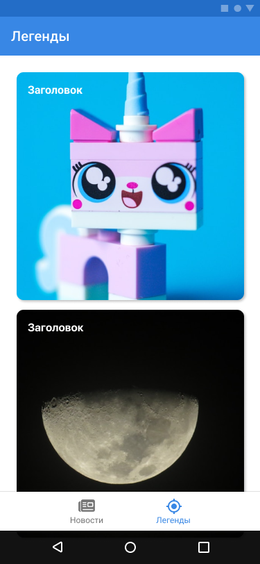

## Тестовое задание для Android разработчика ##


| Места                      | Легенды                    |
|----------------------------|----------------------------|
|  |  |

Стэк:
- Kotlin
- RXJava
- Rest API
- Realm
- Retrofit
- Picasso

Необходимо создать Android/Kotlin приложение c двумя лентами: 
лента новостей и легенд (карточки).
Переключение между лентами происходит при помощи tabbar.
Каждая вкладка представляет из себя отдельный фрагмент.
Для каждой ленты необходимо организовать быструю постраничную 
загрузку данных (infinity scroll). Для загрузки картинок использовать 
Picasso (или другую похожую библиотеку).

Для загрузки данных по API необходимо использовать Retrofit. 
Данные кэшировать в БД Realm. 

Больше всего будет оцениваться скорость загрузки данных, 
плавность работы и работа с данными. Дизайн оценивается в наименьшей 
степени, но просьба примерно придерживаться макетов. 

### Инструкция по работе с API: ###
1. Адрес сервера:
```
https://appadmin.mipt.ru
```
Во всех запросах нужно указывать токен авторизации в header:
```
Authorization: Bearer $TOKEN
```

2. Загрузка новостей:
```
/api/news?page=1&perpage=10&filter[>timeStart]=2021-11-03 16:00:00.000000
```
- `page` - номер страницы
- `perpage` - количество элементов на странице
- `filter[>timeStart]` - фильтрация по дате новости. Формат `"yyyy-MM-dd HH:mm:ss.SSSSSS"`.
Необходимо передавать при открытии приложения для загрузки новых новостей.

Пример ответа (сокращенный):
```json
{
  "status": "success",
  "data": {
    "filter": {
      ">timeStart": "2021-11-03 16:00:00.000000"
    },
    "paginator": {
      "4734": {
        "timeStart": "26.07.2022 11:00",
        "title": "Фонд целевого капитала МФТИ",
        "content": "content",
        "summaryImage": {
          "id": "68864",
          "signatures": [
            {
              "id": "28499",
              "path": "d877c7a1e017ebf105e6e951d6b12371",
              "dir": "75eaf845e81627b71ef0a18d4547aab5",
              "name": "image.jpg",
              "size": 75813,
              "type": "image/jpg",
              "width": 968,
              "height": 645,
              "aspectRatio": 1.5007751937984497
            }
          ]
        },
        "chairs": [
          {
            "id": "189",
            "name": "Фонд целевого капитала МФТИ"
          }
        ],
        "id": "4734"
      }
    },
    "count": 2671,
    "itemsPerPage": 1,
    "page": 1
  }
}
```
Здесь 
- `chairs.first.name` - заголовок новости
- `summaryImage` - изображение
- `content` - текст новости (в приложении отображать первые 6 строк)

3. Загрузка легенд:
```
/api/history?page=1&perpage=10
```
- `page` - номер страницы
- `perpage` - количество элементов на странице
- `filter[>updated]=2021-11-03 16:00:00.000000` - фильтрация по обновления легенды. 
Формат "yyyy-MM-dd HH:mm:ss.SSSSSS". Необходимо передавать при 
открытии приложения для загрузки новых и обновления существующих легенд.

Пример ответа (сокращенный):
```json
{
  "status": "success",
  "data": {
    "filter": [],
    "paginator": {
      "788": {
        "type": "history",
        "timeStart": "24.08.2021 16:01",
        "title": "Double portrait or the rooster story",
        "language": {
          "id": "2",
          "name": "English"
        },
        "summaryImage": {
          "id": "53630",
          "signatures": [
            {
              "id": "12964",
              "path": "4ed4c5ddde88f3b09e6e4a8f382cac33",
              "dir": "75eaf845e81627b71ef0a18d4547aab5",
              "name": "double.jpeg",
              "size": 1657805,
              "type": "image/jpeg",
              "width": 4167,
              "height": 4167,
              "aspectRatio": 1
            }
          ]
        },
        "id": "788", 
        "created": {
          "date": "2021-08-24 16:01:05.000000",
          "timezone_type": 3,
          "timezone": "Europe/Moscow"
        },
        "updated": {
          "date": "2021-08-24 16:01:05.000000",
          "timezone_type": 3,
          "timezone": "Europe/Moscow"
        }
      }
    },
    "count": 10,
    "itemsPerPage": 1,
    "page": 1
  }
}
```

Здесь 
- `title` - заголовок легенды
- `summaryImage` - изображение (наличие гарантируется)
- `updated` - дата обновления

4. Загрузка картинок:
```
https://appadmin.mipt.ru/get-file.php?id={id}&dir={dir}&path={path}&style=thumbnail
```
